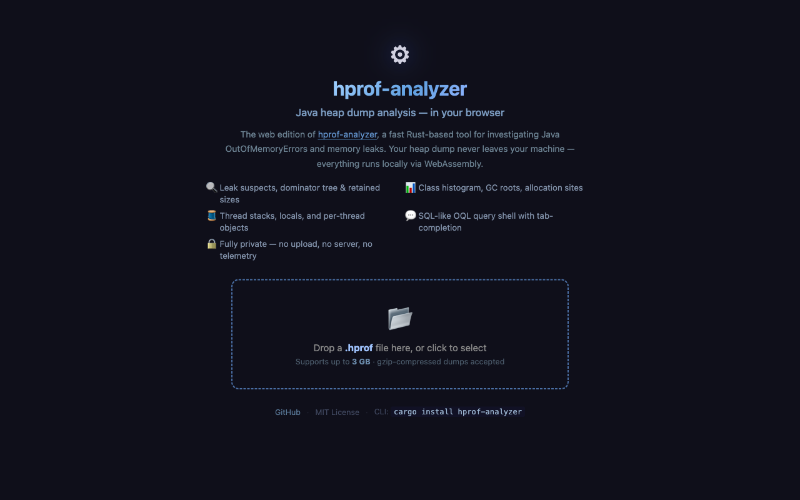
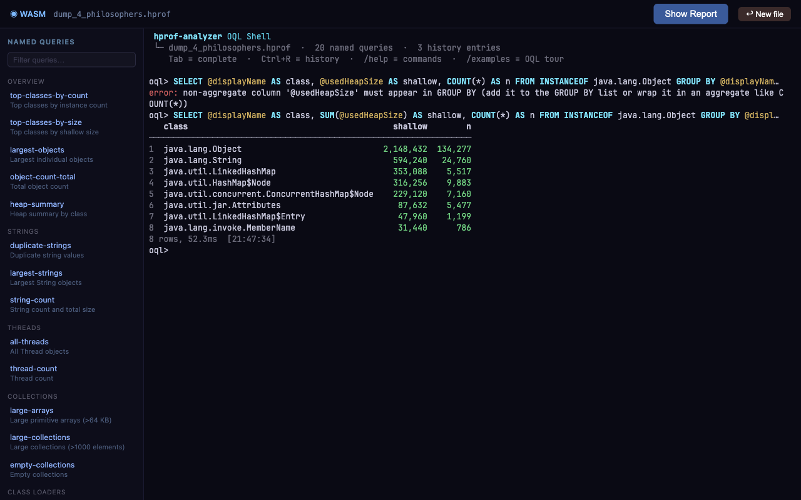
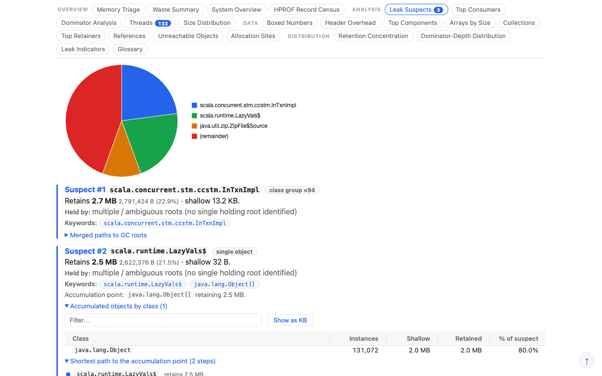

# hprof-analyzer

[](https://github.com/parttimenerd/hprof-analyzer/actions/workflows/ci.yml)
[](https://crates.io/crates/hprof-analyzer)
[](LICENSE)

Your JVM left behind a heap dump. `hprof-analyzer` turns it into answers — leak suspects, retained-size breakdown, OQL queries — without provisioning a machine as big as the file. One binary covers the full workflow: automated reports, interactive analysis, AI-assisted triage via MCP, privacy-safe redaction, and pre-generation of Eclipse MAT caches. For dumps up to 3 GB there is also a [browser version](https://parttimenerd.github.io/hprof-analyzer/) that runs everything in WebAssembly with no install.

*By the [SapMachine](https://sapmachine.io) team.*

## Capabilities at a glance

| Capability | How to use |
|-----------|------------|
| **Analysis reports** — System Overview, Leak Suspects, Top Consumers, Threads | `hprof-analyzer heap.hprof report.html` |
| **OQL queries** — SQL-flavoured, MAT-compatible, with extensions | `hprof-analyzer query heap.hprof --query "..."` |
| **Cached interactive analysis** — histogram, dominator tree, inspect objects | `hprof-analyzer heap summary heap.hprof` |
| **MCP server** — AI-assisted triage in Claude, Cline, and other agents | `hprof-analyzer mcp` |
| **HTTP API** — persistent endpoint for the browser UI (large dumps) and LLM agents | `hprof-analyzer server heap.hprof` |
| **Heap redaction** — zero primitive values before sharing, preserve object graph | `hprof-analyzer redact heap.hprof safe.hprof` |
| **MAT cache generation** — low-RSS alternative to MAT's first-open parse | `hprof-analyzer mat caches heap.hprof /mat/` |
| **Browser UI** — WebAssembly, works offline, up to 3 GB | [Open in browser](https://parttimenerd.github.io/hprof-analyzer/) |
| **Re-render saved reports** — JSON → HTML/Markdown without the original dump | `hprof-analyzer report.json report.html` |

**Why use it:**
- **Low memory.** Two-pass streaming keeps peak RSS well below the dump size — on a 33 GiB dump it peaks at ~15 GiB where MAT needs ~62 GiB. No heap-size flag to tune.
- **Broad JVM support.** Reads dumps from HotSpot, OpenJ9/IBM J9, and Android ART. Handles all HPROF sub-tags including IBM J9 and ART-specific roots.
- **CI-friendly.** Never prompts, never opens a window. JSON output is stable enough to diff; gate a build on retained-size regressions.
- **Resilient.** Truncated dumps, corrupt gzip, and malformed records all produce a partial report with a warning — not a crash.
- **Emailable HTML.** Self-contained, no server, no external assets.

## Quick start

Grab a prebuilt binary and analyze a dump in two commands. No Rust, no Node, no build step.

```sh
# macOS (Apple Silicon)
curl -L https://github.com/parttimenerd/hprof-analyzer/releases/download/nightly/hprof-analyzer-aarch64-apple-darwin.tar.gz | tar xz

# Linux (x86_64, glibc)
curl -L https://github.com/parttimenerd/hprof-analyzer/releases/download/nightly/hprof-analyzer-x86_64-unknown-linux-gnu.tar.gz | tar xz
```

That unpacks a folder containing the `hprof-analyzer` binary. Run it on your dump:

```sh
./hprof-analyzer-*/hprof-analyzer heap.hprof report.html
```

Open `report.html` in any browser. To run it from anywhere, move the binary onto your `PATH`:

```sh
sudo mv hprof-analyzer-*/hprof-analyzer /usr/local/bin/
hprof-analyzer heap.hprof report.html
```

Compressed dumps are read transparently — no manual decompression needed:

| Format | Notes |
|--------|-------|
| `.hprof` | Raw dump |
| `.hprof.gz` | Gzip-compressed dump |
| `.hprof.zip` | ZIP archive containing the dump |
| `.hprof.tar.gz`, `.tar.gz`, `.tgz` | Gzip-compressed tar archive; the first `.hprof` entry is used |

**Tip: use `-XX:+HeapDumpGzip` to write compressed dumps directly.** Gzip-compressed dumps are typically 5–10× smaller than raw `.hprof` files, making them much faster to copy off the production machine before analysis.

**Tip: store a JSON report instead of the dump.** Run the analysis on the production machine and keep only the report — the original dump can then be discarded. The JSON report can be re-rendered into any other format later without the `.hprof` file:

```sh
# On the production machine — fast, low memory, small output:
hprof-analyzer heap.hprof.gz report.json.gz

# Later, anywhere — re-render to HTML without the original dump:
hprof-analyzer report.json.gz --format html report.html
```

**Truncated and corrupt files are handled gracefully.** If the JVM was killed mid-dump, the file was copied incompletely, the gzip stream ends early, or random bytes follow a valid HPROF header, the analyzer recovers whatever objects were successfully parsed and produces a partial report rather than aborting. A warning is printed to stderr and `truncated_input: true` is set in the JSON output.

## Try it in the browser

**➡ [Open the browser UI](https://parttimenerd.github.io/hprof-analyzer/)**

Drop a `.hprof` file directly onto the page — the entire analysis runs in your browser via WebAssembly, no install required. Heap dumps **up to 3 GB** are supported.

| Landing page | OQL shell | Leak suspects report |
|:---:|:---:|:---:|
|  |  |  |

Three modes are available after dropping a file:

- **Analysis** — histogram, leak suspects, dominator tree, GC roots, retained sizes
- **Full Analysis** — adds duplicate-string/array detection and collection fill-ratio
- **OQL Shell** — interactive query shell; named-query sidebar + tab-completion work offline

You can also connect to a locally running server for larger dumps:

```sh
hprof-analyzer server heap.hprof   # prints http://127.0.0.1:7070
```

All REPL commands (`!top`, `!sort`, `!stats`, `!obj`, …) and the full OQL engine work the same way in the browser and in the CLI. Useful shell commands:

```
/help oql        — full OQL language reference (works offline via WASM)
/examples        — guided tour of OQL examples by category
/examples group  — examples for GROUP BY / HAVING queries
```

## Analysis reports

Run one command and get a report covering the same ground as Eclipse MAT's System Overview, Leak Suspects, and Top Consumers analyses, plus additional views. Peak RSS stays well below the dump size: on a 33 GiB dump it peaks at ~15 GiB where MAT needs ~62 GiB (see [Performance](#performance)). The report is a single file you can email, attach to a ticket, or diff in CI.

Report sections:

- **System Overview**: heap size, class/classloader breakdown, duplicate class definitions, GC roots, and a per-class histogram with a largest-instance column.
- **Leak Suspects**: objects retaining the most memory, each traced back to its GC root via the full reference chain.
- **Top Consumers**: classes, classloaders, and packages ranked by *retained* size (not just shallow), so allocations hidden inside containers show up under the right owner.
- **Threads**: stack frames and the local variables each thread keeps alive.
- **Duplicate strings** (opt-in, `--find-duplicates`): wasted bytes from identical `String` values, top offenders, and which classes hold the most string references.
- **Collections analysis** (opt-in, `--collections`): fill ratios, size distributions, collision rates, and per-`Class#field` attribution for every Map, List, Set, and array. Covers standard JDK, Kotlin, and Eclipse Collections; custom types via TOML config.

Pick the format that fits: plain **Markdown**, **Markdown with ASCII graphs** (bars, sparklines, dominator trees), a self-contained **HTML** page, or machine-readable **JSON**.

A live viewer shows all four output formats side by side, built from the public [Renaissance benchmark](https://renaissance.dev/) `scala-doku` dump:

**➡ [Open the sample report viewer](https://parttimenerd.github.io/hprof-analyzer/reports/)**

| Format | Default options | All optional features |
|--------|-----------------|-----------------------|
| Plain Markdown | [`scala-doku.md`](docs/samples/scala-doku.md) | [`scala-doku-full.md`](docs/samples/scala-doku-full.md) |
| Markdown with ASCII graphs | [`scala-doku.graphs.md`](docs/samples/scala-doku.graphs.md) | [`scala-doku-full.graphs.md`](docs/samples/scala-doku-full.graphs.md) |
| Self-contained HTML (opens live) | [`scala-doku.html`](https://parttimenerd.github.io/hprof-analyzer/samples/scala-doku.html) | [`scala-doku-full.html`](https://parttimenerd.github.io/hprof-analyzer/samples/scala-doku-full.html) |
| Machine-readable JSON | [`scala-doku.json`](docs/samples/scala-doku.json) | [`scala-doku-full.json`](docs/samples/scala-doku-full.json) |

### Common tasks

#### Find what is consuming the most memory

The `top-consumers` view ranks object types by retained heap — the amount of memory that would be freed if all instances of that class were collected:

```bash
hprof-analyzer heap.hprof report.html
# Open report.html → "Top Consumers" tab

# Fast command-line answer (cached after first run):
hprof-analyzer heap report heap.hprof --section top
```

#### Find the likely cause of an OutOfMemoryError

The `leak-suspects` view groups objects into accumulation points — classes where many instances exist that share a common path from a GC root:

```bash
hprof-analyzer heap.hprof report.html
# Open report.html → "Leak Suspects" tab

# Text summary (cached after first run):
hprof-analyzer heap summary heap.hprof
# or the full leaks section:
hprof-analyzer heap report heap.hprof --section leaks
```

### Flag reference

| Flag | Description |
|------|-------------|
| `--find-duplicates` | Detect content-identical `String` values and primitive arrays; reports wasted bytes and top offenders. |
| `--collections` | Container attribution by holder `Class#field`: fill ratios, size distributions, collision rates. Adds ~300 MB peak RSS on large dumps. |
| `--obj-graph[=small\|medium\|large]` | Capture the outbound-reference graph for the top retained objects. Enables the interactive Object Graph Explorer in HTML reports. Implied by `--full-analysis`. |
| `--full-analysis` | Shorthand for `--obj-graph --collections --find-duplicates`. Adds ~330 MB peak RSS on large dumps. |
| `--field-stats` | Per-class reference-field null/non-null/retained stats for the top-50 classes by instance count. |
| `--ref-paths` | Capture field-name labels on reference edges (~2 bytes/edge). Enables named field breakdowns in `--field-stats` and richer root paths. |
| `--reachable-only` | Restrict OQL results to GC-reachable objects (Eclipse MAT parity). Off by default. |
| `--detail minimal\|default\|max` | Adjust output-size caps. See [detail preset table](#tune-the-report-size-with---detail) below. |
| `--mat <DIR>` | Emit Eclipse MAT-compatible binary index files into `DIR` alongside the normal analysis. |
| `--query <OQL>` | Run an OQL query and embed results in the report. May be repeated. |
| `--query-file <PATH>` | Read one OQL query per non-empty line from a file. |
| `--progress auto\|always\|never` | Control the live progress line on stderr. Default: `auto` (terminal only). |

### Tune the report size with `--detail`

| `--detail`  | root depth | alloc top | thread locals | dom nodes | dom depth | leak children | top consumers |
| ----------- | ---------: | --------: | ------------: | --------: | --------: | ------------: | ------------: |
| `minimal`   |         10 |        15 |             5 |       500 |        10 |            15 |            10 |
| `default`   |         30 |        50 |            20 |     5,000 |        20 |            50 |            20 |
| `max`       |        200 |       500 |           100 |   100,000 |        50 |           500 |           100 |

## OQL queries

Run SQL-flavoured queries against a heap dump. The OQL engine is modelled on Eclipse MAT's dialect and extends it with aggregates, grouping, visualization directives, an interactive REPL, and named queries.

### `query` subcommand — fast streaming queries

The `query` subcommand does a streaming parse and answers queries without building a full report:

```sh
# Count all String instances
hprof-analyzer query heap.hprof --query "SELECT COUNT(*) FROM java.lang.String"

# Top 10 threads by shallow size
hprof-analyzer query heap.hprof \
    --query "SELECT @displayName, @usedHeapSize FROM java.lang.Thread ORDER BY @usedHeapSize DESC LIMIT 10"

# Multiple queries in one pass
hprof-analyzer query heap.hprof \
    --query "SELECT COUNT(*) FROM java.lang.String" \
    --query "SELECT COUNT(*) FROM java.lang.Thread"

# Interactive REPL with tab-completion
hprof-analyzer query heap.hprof --repl
```

Retained sizes (`@retainedHeapSize`), dominators, and reference-graph attributes require the full analysis pipeline. Pass `--query` / `--query-file` to the main command to embed queries in a full report, or use the `server` or `heap query` subcommands which unlock retained-size queries.

### Embed queries in reports

```sh
hprof-analyzer heap.hprof report.html \
    --query "SELECT @displayName, @retainedHeapSize FROM java.lang.Thread ORDER BY @retainedHeapSize DESC LIMIT 20"
```

### Visualization directives (`-- @viz`)

Prefix any query with a `-- @viz` comment to request a chart in the report:

```sh
hprof-analyzer heap.hprof report.html --query="-- @viz histogram label=@displayName value=@retainedHeapSize cap=10
SELECT @displayName, @retainedHeapSize FROM java.lang.Thread ORDER BY @retainedHeapSize DESC"
```

Kinds: `table` (default), `histogram`, `piechart`, `treemap`. HTML renders interactive charts; Markdown renders ASCII bars.

Use `--query=` (with `=`) to avoid `clap` misinterpreting the leading `--` in the directive as a flag.

### Compatibility with Eclipse MAT OQL

**Extensions (not in MAT):** `MEDIAN`/`PERCENTILE` aggregates, `GROUP BY` / `HAVING`, `path()` reachability, `-- @viz` directives, arithmetic in `SELECT` and `WHERE`, system-properties snapshot (`@systemProperties`), interactive REPL with tab-completion, named queries library (`!run <name>`), report embedding (`--query` / `--query-file`).

**Behavioural differences:** unreachable objects are *included* (MAT discards them); `s.count`/`s.offset` are absent (modern JDK layout — use `s.value`, `s.coder`); integer division by zero returns `NULL`; `toString()` on non-String returns `NULL` (no live JVM reflection).

**Not yet supported:** `FROM OBJECTS <decimal-id>` (hex works), array indexing (`s[0]`), `${snapshot}.getClasses()`. Some object-ref field navigations (where the declared type is `Object`) silently return `NULL` — see [docs/OQL.md § Eclipse MAT OQL compatibility](docs/OQL.md#eclipse-mat-oql-compatibility) for details and workarounds.

The full OQL language reference — grammar, attributes, aggregates, visualization directives, worked examples — is in [docs/OQL.md](docs/OQL.md).

## Cached interactive analysis

The `heap` subcommand group runs the full analysis pipeline once, writes a cache alongside the dump, and makes all results available in ~1 s on every subsequent call. No flags or setup needed — the cache is transparent. This is the fastest interface for repeated exploration of the same dump.

```sh
# First run: full analysis (5–15 min on large dumps), writes cache
hprof-analyzer heap summary heap.hprof

# All subsequent runs load from cache in ~1 s — any subcommand:
hprof-analyzer heap histogram heap.hprof
hprof-analyzer heap query heap.hprof --oql "SELECT @displayName, COUNT(*) FROM INSTANCEOF java.lang.Object GROUP BY @displayName ORDER BY COUNT(*) DESC LIMIT 20"
```

Available subcommands:

| Subcommand | Description |
|------------|-------------|
| `heap summary <dump>` | Top leak suspects + top classes by retained size |
| `heap report <dump> [--section S]` | Full or section report. Sections: `leaks`, `top`, `threads`, `overview`, `triage`, `waste`, `indicators`, `retainers`, `arrays`, `collections`, `references`, `dominators`, `components`, `alloc_sites`, `thread_locals`, `framework`, `field_stats`, `all` |
| `heap histogram <dump> [--limit N]` | Class histogram with instance + retained counts |
| `heap query <dump> --oql "..."` | Run an OQL query (add `--json` for machine-readable output) |
| `heap browse <dump> [--index N] [--depth D] [--width W]` | Browse dominator tree (omit `--index` to start at root) |
| `heap inspect <dump> --index N` | Inspect a specific object by dense index |
| `heap docs [--topic syntax\|attributes\|examples\|workflow]` | Full OQL reference (no dump needed) |
| `heap load <dump> [--with-graph]` | Pre-populate cache; `--with-graph` adds field-value queries |
| `heap cache-list [<dump>]` | Show cache entries and sizes |
| `heap cache-clear <dump>` | Delete cache for a dump |

Add `--json` to any subcommand for machine-readable output. Object indices for `heap inspect` come from the `@objectId` column in query results or from `heap browse` output.

## MCP server — AI-assisted heap analysis

`hprof-analyzer` ships a built-in **Model Context Protocol (MCP) server** that lets Claude, Cline, and other MCP-compatible AI assistants analyze heap dumps interactively. The first `load_dump` call runs the full analysis and writes a cache; all subsequent calls load in ~1 s.

### Setup

**Claude Code** (one command):
```sh
claude mcp add hprof -- hprof-analyzer mcp
```

**Cline (VS Code)** — open the Cline panel, click **MCP Servers → Add Server**, then paste:
```json
{
  "hprof": {
    "command": "hprof-analyzer",
    "args": ["mcp"]
  }
}
```

Alternatively, add it directly to `.vscode/mcp.json` (workspace-scoped) or Cline's global MCP settings file at `~/.config/Code/User/globalStorage/saoudrizwan.claude-dev/settings/cline_mcp_settings.json` (Linux/macOS) / `%APPDATA%\Code\User\globalStorage\saoudrizwan.claude-dev\settings\cline_mcp_settings.json` (Windows).

**Claude Desktop** — add to `~/Library/Application Support/Claude/claude_desktop_config.json` (macOS) or `%APPDATA%\Claude\claude_desktop_config.json` (Windows):
```json
{
  "mcpServers": {
    "hprof": {
      "command": "hprof-analyzer",
      "args": ["mcp"]
    }
  }
}
```

**With a dump pre-loaded** (skips the `load_dump` step):
```sh
claude mcp add hprof -- hprof-analyzer mcp --dump /path/to/heap.hprof
```

### MCP tools

| Tool | Description |
|------|-------------|
| `get_session_info` | Check if a dump is loaded and see basic stats. Call this first. |
| `get_oql_docs` | OQL language reference + workflow guide. No dump needed. |
| `load_dump` | Load a `.hprof`, `.hprof.gz`, or `.hprof.zip` file. Fast after first run. |
| `get_summary` | Top 5 leak suspects + top 5 classes by retained size. |
| `get_histogram` | Class histogram with instance + retained counts. |
| `get_report` | Full report or a named section as JSON. Core: `leaks`, `top`, `threads`, `overview`. Analysis: `triage` ⭐, `waste`, `indicators`, `retainers`, `arrays`, `collections`, `references`, `dominators`, `components`, `alloc_sites`, `thread_locals`, `framework`, `field_stats`. Default: `all`. |
| `list_views` | List all 20 built-in named query views (usable directly in `query()`). |
| `query` | Run an OQL query or a built-in view by name; returns `{columns, rows, row_count, truncated}`. |
| `browse_dominators` | Navigate dominator tree. Omit `object_index` to start at the GC root. |
| `inspect_object` | Class, shallow/retained sizes for a specific object. |
| `redact` | Zero primitive values in a dump while preserving the object graph. |

### Typical investigation

```
1. get_session_info                     — check if a dump is already loaded
2. load_dump({path})                    — load the dump (fast from cache after first run)
3. get_report({section:"triage"})  ⭐  — automated severity signals; fastest orientation
4. get_report({section:"leaks"})        — root paths, accumulation points, dominated objects
5. get_summary                          — top suspects + suggested OQL queries
6. get_histogram                        — class-level breakdown by retained size
7. query({oql:"..."})                   — drill in with OQL (or use a view name)
8. browse_dominators                    — navigate the dominator tree from root or a suspect
9. inspect_object                       — details on a specific object
```

**Tip:** call `get_oql_docs({topic:"examples"})` for 20 worked queries covering common patterns: string waste, leak detection, dominator walk, thread locals, etc.

**Cache:** writes to `<dump>.hprof-cache/` alongside the dump. Delete to force re-analysis.

### Claude Code skills

Ready-made skills teach Claude the full API and common heap-triage workflows. Copy them into `~/.claude/skills/` or load them inline:

```
# Server-backed skill (full API, recommended for large dumps)
@skills/hprof-analyzer.md
"Identify the top memory consumers in http://127.0.0.1:7070"

# CLI-only skill (uses the cached heap subcommand group, no server needed)
cp skills/hprof-analyzer-cli.md ~/.claude/skills/hprof-analyzer-cli/SKILL.md
```

## HTTP API (`server` subcommand)

`server` starts a lightweight HTTP API on `127.0.0.1` (loopback only). The primary use cases are connecting the browser UI to a local server for dumps larger than 3 GB, and giving LLM agents a persistent endpoint for OQL queries and report sections. For scripting and CI, the individual CLI commands (`hprof-analyzer heap query`, `hprof-analyzer heap report`, etc.) are simpler.

```sh
hprof-analyzer server heap.hprof           # default port 7070
hprof-analyzer server heap.hprof --port 8080
```

**Key endpoints:**

| Method | Path | Description |
|--------|------|-------------|
| GET | `/status` | `{"status":"ready"\|"analyzing"\|"not_started"}` |
| POST | `/analyze` | Trigger full analysis (retained sizes, dominators) |
| POST | `/` | Run OQL query → JSON |
| POST | `/stream` | Run OQL query → NDJSON (streaming) |
| GET | `/report` | Full report JSON (or `?format=md`) |
| GET | `/report/overview` | System overview section |
| GET | `/report/leaks` | Leak suspects section |
| GET | `/report/top` | Top consumers section |
| GET | `/report/threads` | Thread overview section |

**Lazy analysis:** the first `GET /report/…` triggers analysis automatically. Report endpoints return `202 Accepted` while analysis is running; poll `GET /status` until `"ready"`.

```sh
# Start server, trigger analysis, wait, then query
hprof-analyzer server heap.hprof &
curl -s -X POST http://127.0.0.1:7070/analyze
until curl -sf http://127.0.0.1:7070/status | grep -q '"ready"'; do sleep 1; done

# Report sections
curl -s 'http://127.0.0.1:7070/report/leaks?limit=5' | jq .
curl -s 'http://127.0.0.1:7070/report/overview?format=md'

# OQL query
curl -s http://127.0.0.1:7070/ -d 'SELECT COUNT(*) FROM java.lang.String'
```

See [docs/OQL.md — server subcommand](docs/OQL.md#server-subcommand) for the full endpoint reference, body format, NDJSON streaming, and error response shapes.

## Heap redaction

Before sharing a heap dump — with colleagues, in a bug report, or with a vendor — you may want to zero out the actual data while keeping the object graph intact. The `redact` subcommand does this in a single pass:

```sh
# Default: lean mode — zeroes all primitive array elements (byte[], char[], int[], …)
hprof-analyzer redact heap.hprof safe.hprof

# Complete mode — also zeroes scalar instance fields and CLASS_DUMP static values
hprof-analyzer redact --complete heap.hprof safe.hprof

# Pipe-friendly: write to stdout (progress suppressed automatically)
hprof-analyzer redact heap.hprof - > safe.hprof
```

Redacted dumps are readable by hprof-analyzer, Eclipse MAT, and jhat. A marker record (`REDACTED\x01`, tag `0xDE`) is embedded so hprof-analyzer can show a "Redacted dump" banner in reports.

**Lean vs. complete mode:**

| Mode | What is zeroed | Use when |
|------|---------------|----------|
| **Lean** (default) | All primitive array elements (`byte[]`, `char[]`, `int[]`, `long[]`, etc.) | Throughput matters; leaking scalar fields like `String.hash` is acceptable |
| **Complete** (`--complete`) | Array elements + scalar instance fields + CLASS_DUMP static values | Strongest privacy guarantee needed |

A standalone `hprof-redact` binary is also available for environments where a minimal dependency footprint matters (under 1 MB). The MCP server exposes redaction via the `redact` tool with an optional `complete` parameter.

## Speeding up Eclipse MAT

If you use Eclipse MAT for interactive heap exploration, hprof-analyzer can dramatically reduce the time and memory needed for MAT's first open of a large dump.

MAT's first open of a 34 GB heap dump peaks at **~55 GB RSS** inside the JVM. hprof-analyzer generates the same cache files in a single pass peaking at **~19 GB RSS**:

```sh
# Generate MAT cache files (low RSS, no JVM tuning needed)
hprof-analyzer mat caches heap.hprof /path/to/heap-dir/

# Now open heap.hprof in MAT as usual — it detects the cache and skips parsing
```

MAT auto-detects the cache: if the index files are present and newer than the `.hprof`, it prints "Reopening parsed heap dump file" and skips its own parser.

If you also want hprof-analyzer's own report, generate both in one pass (single hprof read, shared pipeline):

```sh
hprof-analyzer heap.hprof --mat /path/to/heap-dir/ report.html
```

See [`docs/mat-cache.md`](docs/mat-cache.md) for the full list of generated files, known divergences from MAT's output, and the RSS budget details.

## Install

### Prebuilt binary (recommended)

No Rust, no Node.js. Download for your platform from the rolling [`nightly`](https://github.com/parttimenerd/hprof-analyzer/releases/tag/nightly) release (always tracks `main`):

| Platform | Archive |
| --- | --- |
| Linux x86_64 (glibc) | [`hprof-analyzer-x86_64-unknown-linux-gnu.tar.gz`](https://github.com/parttimenerd/hprof-analyzer/releases/download/nightly/hprof-analyzer-x86_64-unknown-linux-gnu.tar.gz) |
| Linux x86_64 (static musl) | [`hprof-analyzer-x86_64-unknown-linux-musl.tar.gz`](https://github.com/parttimenerd/hprof-analyzer/releases/download/nightly/hprof-analyzer-x86_64-unknown-linux-musl.tar.gz) |
| Linux aarch64 (glibc) | [`hprof-analyzer-aarch64-unknown-linux-gnu.tar.gz`](https://github.com/parttimenerd/hprof-analyzer/releases/download/nightly/hprof-analyzer-aarch64-unknown-linux-gnu.tar.gz) |
| Linux aarch64 (static musl) | [`hprof-analyzer-aarch64-unknown-linux-musl.tar.gz`](https://github.com/parttimenerd/hprof-analyzer/releases/download/nightly/hprof-analyzer-aarch64-unknown-linux-musl.tar.gz) |
| macOS (Apple Silicon) | [`hprof-analyzer-aarch64-apple-darwin.tar.gz`](https://github.com/parttimenerd/hprof-analyzer/releases/download/nightly/hprof-analyzer-aarch64-apple-darwin.tar.gz) |
| Windows x86_64 | [`hprof-analyzer-x86_64-pc-windows-msvc.zip`](https://github.com/parttimenerd/hprof-analyzer/releases/download/nightly/hprof-analyzer-x86_64-pc-windows-msvc.zip) |

Use the musl build on minimal containers or older distros (no libc dependency).

```sh
curl -L https://github.com/parttimenerd/hprof-analyzer/releases/download/nightly/hprof-analyzer-x86_64-unknown-linux-gnu.tar.gz | tar xz
sudo mv hprof-analyzer-*/hprof-analyzer /usr/local/bin/
```

**Already installed?** Update to the latest nightly in one command:

```sh
hprof-analyzer update nightly
```

### With Homebrew (macOS / Linux)

```sh
brew tap parttimenerd/hprof-analyzer
brew trust parttimenerd/hprof-analyzer   # required once for third-party taps (Homebrew 6+)
brew install hprof-analyzer
```

Homebrew prints MCP setup instructions after install. To follow the rolling nightly build:

```sh
brew install parttimenerd/hprof-analyzer/hprof-analyzer-nightly
```

### With Cargo

Requires Rust 1.85+. If you don't have it, install [rustup](https://rustup.rs/) first:

```sh
curl --proto '=https' --tlsv1.2 -sSf https://sh.rustup.rs | sh
cargo install hprof-analyzer
```

### From source

```sh
git clone https://github.com/parttimenerd/hprof-analyzer
cd hprof-analyzer
cargo build --release
# binary at target/release/hprof-analyzer
```

Node.js/npm is only needed if you modify the web sources under `web/src/`.

## Command reference

### Subcommand overview

```
hprof-analyzer <INPUT> [OUTPUT] [OPTIONS]

  <INPUT>   a .hprof, .hprof.gz, .hprof.zip, .hprof.tar.gz, .tar.gz, or .tgz heap dump
              → analyze it and write a report
            a saved report .json[.gz] → re-render it to another format

Named subcommands:
  compare      Compare reports (MAT export vs ours, or two of ours across time)
  completions  Generate a shell completion script
  heap         Cached interactive analysis: query, browse, inspect (see above)
  mat          Generate Eclipse MAT index cache files
  mcp          Start the MCP server for AI assistant integration (Claude, Cline, etc.)
  query        Run OQL queries against a heap dump (no full report needed)
  redact       Zero primitive values in a dump while preserving the object graph
  server       Serve OQL + report sections over HTTP
  dev          Developer / diagnostic commands
```

### Analyze a dump

Output format is inferred from the extension; `-f` always wins. Stdout defaults to plain Markdown.

```sh
hprof-analyzer heap.hprof                    # plain Markdown to stdout
hprof-analyzer heap.hprof report.html        # HTML
hprof-analyzer heap.hprof report.json        # JSON
hprof-analyzer heap.hprof report.json.gz     # gzip-compressed JSON (~20× smaller)
hprof-analyzer heap.hprof -f md-graphs       # Markdown with ASCII graphs
```

Add `--find-duplicates` or `--collections` to enable the opt-in sections.

### Compare against a MAT export

```sh
hprof-analyzer heap.hprof report.json
hprof-analyzer compare mat mat_System_Overview.zip report.json
```

### Track growth across two dumps

```sh
hprof-analyzer early.hprof a.json
hprof-analyzer later.hprof b.json
hprof-analyzer compare reports a.json b.json
```

### Re-render a saved report

```sh
hprof-analyzer report.json                    # Markdown to stdout
hprof-analyzer report.json report.html        # HTML
hprof-analyzer report.json -f md-graphs       # Markdown with ASCII graphs
hprof-analyzer report.json.gz -f md-graphs    # reads .gz transparently
```

### Shell completions

```sh
hprof-analyzer completions zsh  > ~/.zsh/completions/_hprof-analyzer
hprof-analyzer completions bash > /etc/bash_completion.d/hprof-analyzer
```

### JSON schema

The JSON report format is described by [`docs/schema.json`](docs/schema.json) (JSON Schema draft-2020-12). To regenerate it after model changes:

```sh
hprof-analyzer dev emit-schema > schema/report.schema.json
cp schema/report.schema.json docs/schema.json
```

## Eclipse MAT and other tools

hprof-analyzer is a good fit for most heap analysis work: automated reports, OQL scripting, CI integration, AI-assisted triage, and low-memory environments. For interactive GUI exploration — walking the object graph manually, inspecting arbitrary fields, using MAT's analysis plugins — **[Eclipse MAT](https://eclipse.dev/mat/)** remains the best choice. The two tools complement each other: use hprof-analyzer for triage, CI, and MAT cache generation; switch to MAT when you need hands-on exploration.

If all you need is a class histogram, [`hprof-slurp`](https://github.com/agourlay/hprof-slurp) is faster and lighter because it never builds the dominator tree. That also means it cannot report retained sizes, leak suspects, root paths, or Top Consumers.

## Performance

Measured on an AMD Ryzen Threadripper PRO 3995WX (64 cores / 128 threads) with 123 GiB RAM, Linux, commit [`ea0ace8`](https://github.com/parttimenerd/hprof-analyzer/commit/ea0ace8), 2026-08-12. "Basic" = default analysis; "Full" = `--full-analysis` (`--obj-graph --collections --find-duplicates`). MAT = Eclipse MAT 1.17.0 (`ParseHeapDump.sh -Xmx80g`). Wall-clock in `m:ss` or `s`. RSS is peak.

| Workload | Dump file | Wall basic | RSS basic | Wall full | RSS full | Wall (MAT) | RSS (MAT) |
|----------|-----------|------------|-----------|-----------|----------|------------|-----------|
| Renaissance scala-doku | 51 MiB | 2.4 s | 40 MiB | 5.7 s | 373 MiB | 0:04 | 1.63 GiB |
| gauss-mix | 70 MiB | 2.1 s | 44 MiB | 3.3 s | 195 MiB | 0:04 | 1.61 GiB |
| naive-bayes (1.3 GiB) | 1.3 GiB | 5.0 s | 67 MiB | 8.2 s | 382 MiB | 0:05 | 1.73 GiB |
| VS Code JVM (1.1 GiB) | 1.1 GiB | 0:43 | 216 MiB | 1:13 | 2.51 GiB | 0:28 | 2.39 GiB |
| HeapothesYs 16g | 11 GiB | 2:49 | 565 MiB | 4:07 | 6.32 GiB | 1:06 | 4.99 GiB |
| HeapothesYs 28g | 20 GiB | 5:31 | 1.05 GiB | 8:00 | 12.1 GiB | 2:10 | 5.27 GiB |
| Real-world 34g | 34 GiB | 18:28 | 16.1 GiB | 18:34 | 19.8 GiB | 2:19:17 | 5.18 GiB |

MAT was run with `ParseHeapDump.sh -Xmx80g` (leak-suspects + top-components). `hprof-analyzer` holds peak RSS well below the dump size and needs no heap tuning. Correctness is validated against MAT 1.17.0: the `compare mat` subcommand diffs a MAT System Overview export against our JSON, and the parity fixtures gate on it.

## How it works

The two-pass parser, the dominator-tree construction, the shallow/retained size formulas, and the compressed index structures are described in [DESIGN.md](DESIGN.md).

## Contributing

Contributions are welcome. See [DESIGN.md](DESIGN.md) for architecture context.

Requires a stable Rust toolchain (1.85+); see [Install](#install). All commands from the repository root:

```sh
cargo build --release        # binary at target/release/hprof-analyzer
cargo test --release         # unit tests + JSON-schema + report parity fixtures
cargo fmt --all -- --check   # formatting gate (matches CI)
cargo clippy --release --all-targets -- -D warnings   # lint gate (matches CI)
```

CI runs the same `fmt`, `clippy`, and `test` steps on stable. Parity fixtures live under `tests/fixtures/`.

The HTML report embeds a pre-committed React bundle (`web/dist/bundle.js`), so Node.js is not needed for normal builds. To rebuild it after changing `web/src/`: `cd web && npm install && npm run build`.

The self-contained browser bundle is assembled from the WASM module and the React bundle by `web-browser/assemble.py`:

```sh
# Build WASM module first
wasm-pack build crates/hprof-wasm --target web --release

# Assemble the browser bundle
python3 web-browser/assemble.py           # → dist/hprof-analyzer-browser.html
python3 web-browser/assemble.py -o /tmp/bundle.html   # custom output path
```

## Support & Feedback

Bug reports, feature requests, and contributions are welcome via [GitHub issues](https://github.com/parttimenerd/hprof-analyzer/issues).

## License

MIT. See [LICENSE](LICENSE).

Copyright 2026 SAP SE or an SAP affiliate company, Johannes Bechberger and contributors.
